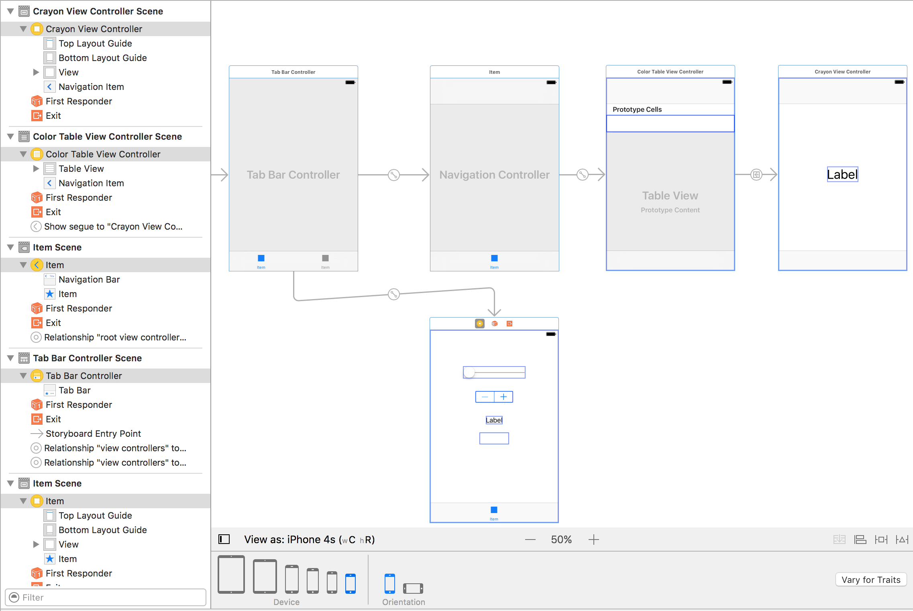

# AC3.2 Unit 2 Final Assessment

# Setup

1. Fork repo which has only a README.md and .gitignore.
2. Clone **your fork** locally to your laptop.
3. Create a project into that cloned directory. Name it AC3.2Unit2FinalAssessment.
4. Work on the assignment.
5. Upon completion, commit locally.

	```
	git commit -a -m "I'm done"
	```
7. Push to your repo.

	```
	git push origin master
	```
8. Go to github and make a pull request.

# The Assessment

1. Create a single view application in XCode.
2. Build the View Controller architecture as depicted in this image:

There are a variety of ways to accomplish this. Any one of them is fine.
3. Create the _necessary_ custom sub-classes for appropriate view controller using New>>File>>Cocoa Touch File.
4. Make a Swift file (not a Cocoa Touch Class) named CrayonData.swift and put this content in it:

	```swift
//
//  ColorData.swift
//  Unit2FinalAssessment
//
//  Created by Jason Gresh on 10/5/16.
//  Copyright © 2016 C4Q. All rights reserved.
//

import Foundation

let crayolaColors = [
    [
        "hex": "#EFDECD",
        "name": "Almond",
        "rgb": "(239, 222, 205)"
    ],
    [
        "hex": "#CD9575",
        "name": "Antique Brass",
        "rgb": "(205, 149, 117)"
    ],
    [
        "hex": "#FDD9B5",
        "name": "Apricot",
        "rgb": "(253, 217, 181)"
    ],
    [
        "hex": "#78DBE2",
        "name": "Aquamarine",
        "rgb": "(120, 219, 226)"
    ],
    [
        "hex": "#87A96B",
        "name": "Asparagus",
        "rgb": "(135, 169, 107)"
    ],
    [
        "hex": "#FFA474",
        "name": "Atomic Tangerine",
        "rgb": "(255, 164, 116)"
    ],
    [
        "hex": "#FAE7B5",
        "name": "Banana Mania",
        "rgb": "(250, 231, 181)"
    ],
    [
        "hex": "#9F8170",
        "name": "Beaver",
        "rgb": "(159, 129, 112)"
    ],
    [
        "hex": "#FD7C6E",
        "name": "Bittersweet",
        "rgb": "(253, 124, 110)"
    ],
    [
        "hex": "#000000",
        "name": "Black",
        "rgb": "(0,0,0)"
    ],
    [
        "hex": "#ACE5EE",
        "name": "Blizzard Blue",
        "rgb": "(172, 229, 238)"
    ],
    [
        "hex": "#1F75FE",
        "name": "Blue",
        "rgb": "(31, 117, 254)"
    ],
    [
        "hex": "#A2A2D0",
        "name": "Blue Bell",
        "rgb": "(162, 162, 208)"
    ],
    [
        "hex": "#6699CC",
        "name": "Blue Gray",
        "rgb": "(102, 153, 204)"
    ],
    [
        "hex": "#0D98BA",
        "name": "Blue Green",
        "rgb": "(13, 152, 186)"
    ],
    [
        "hex": "#7366BD",
        "name": "Blue Violet",
        "rgb": "(115, 102, 189)"
    ]
]
	```

5. Extra credit. Create a convenience initializer the Crayon model that uses the rgb field instead of the hex field.
	```swift
        "rgb": "(205, 149, 117)"
    ```